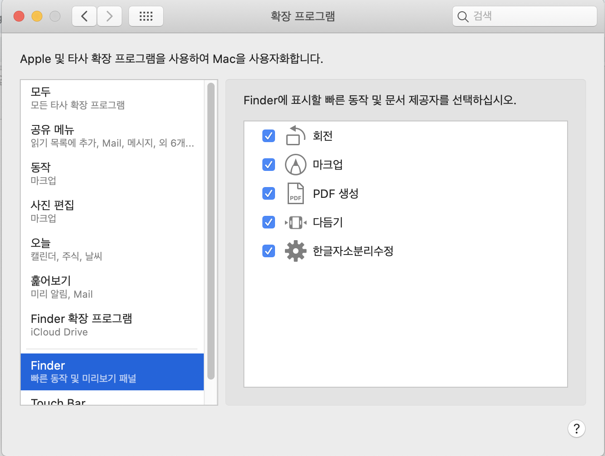
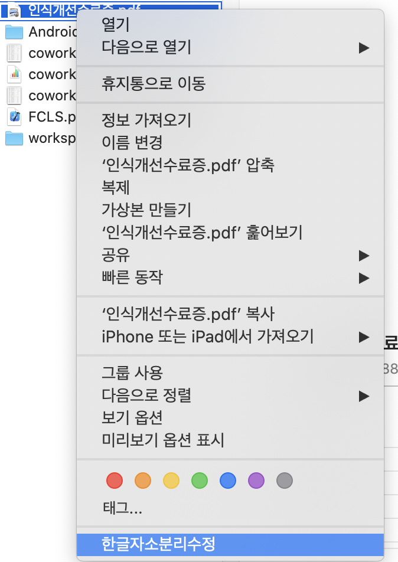

 1. 원비즈에서 한글 파일 첨부시 다음과같이 자음/모음이 분리돼 표시가되는 문제가있습니다.
(맥에서는 정상적으로 보이나 윈도우에서 보면 분리되어 보입니다)

2. 파일을 다운로드하여 압축을해제합니다. [다운로드](https://github.com/drone0898/shareMarkDown/blob/main/%E1%84%92%E1%85%A1%E1%86%AB%E1%84%80%E1%85%B3%E1%86%AF%E1%84%8C%E1%85%A1%E1%84%89%E1%85%A9%E1%84%87%E1%85%AE%E1%86%AB%E1%84%85%E1%85%B5%E1%84%89%E1%85%AE%E1%84%8C%E1%85%A5%E1%86%BC.zip)

3. 동작을 설치합니다.

4.확장프로그램 - Finder에 한글자소분리수정이 추가되고 체크되었는지 확인하고 창을 종료합니다.

5. 원비즈에 첨부할 문서 우클릭 → 한글자소분리수정을 실행합니다.
(실행 후 아무 반응은 없습니다)

6. 1초정도 잠시 기다린 후 원비즈에 파일을 첨부하면 자소분리 문제가 해결됩니다.
